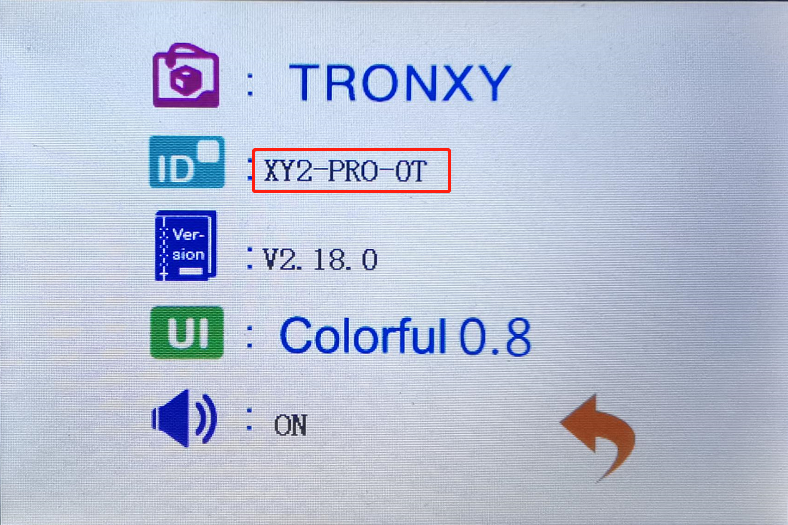
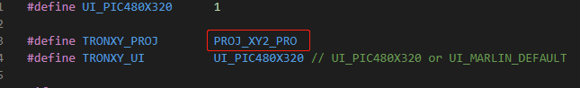
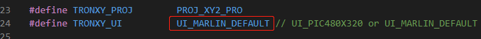

## Applicable printers
  - Support MCU: STM32F103Z
  - Version: 2.18.0 

  1|2|3|4|5|6
  --------|--------|-------|-------|-------|-------
  XY2-PRO|XY2_PRO_2E|XY3_PRO|XY3_PRO_V2
  X5SA|X5SA_g|X5SA_PRO|X5SA_2E|X5SA400_PRO|X5SA400_2E
  XY3SE|XY3SE_2E|XY3SE_V2
  D01|D01_PLUS
  C2|XY3_PROPB

## How to compile

  1. Install [vscode](https://code.visualstudio.com/), and install platformio plugin in the vscode extension.
  2. Download this firmware and unzip it, you will get a firmware folder. Run vscode -> file -> Open Folder, select the firmware folder, open it.
  3. Check the model on the machine: Start the printer, enter the System ->Info interface, and when the firmware version is above 2.16, you can view the relevant information of the current model, as shown in the following figure.

  
  4. If the applicable model listed on this page does not have your model, please download another appropriate firmware.
  5. Open Marlin/TronxyMachine.h, Find #define TRONXY_ PROJ, change the following project name to PROJ_ XXX (XXX represents your printer model)
    - Note: The modified project name must be a name defined above the file(TronxyMachine.h). If there is no such name, contact customer service for handling
    e.g. your model is XY2_PRO:

  6. Compile the firmware. If an error occurs, please refer to the FAQ for solutions.The first compilation may take a long time, then the compiled target file is placed in the 'update' folder.
  7. Copy the 'update' folder into the root directory of the SD card, insert the card into the printer, restart, and the machine will automatically update the firmware. After that, the machine will run the current firmware.

## FAQ

  1. If you want to switch back to the original interface of Marlin, just define "#define TRONXY_UI" in "Marlin/TronxyMachine.h" as UI_MARLIN_DEFAULT

  2. If you encounter problems like " multiple definition of 'EXTI1_IRQHandler' " as shown below, please find the location of the file in the figure below

    open the file and comment out “void EXTI1_IRQHandler(void)”(according to the error message) function, as shown in the figure.

